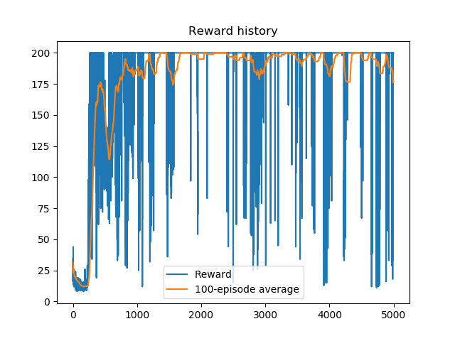

# Reinforcement Learning 

This repository contains projects and experiments in the domain of Reinforcement Learning

Resources about he Proximal Policy Optimization Algorithms (PPO) may be found [here](./PPO). 

## PPO

Proximal Policy Optimization Algorithms ( [paper here](https://arxiv.org/abs/1707.06347)), were proposed in 2017 and have produced respectable results. These are a family of policy gradient methods which propose a simple, yet powerful method that happens to be much more sample efficient than the popular DQN method. The purpose of this repo is to provide reference resources for those attempting to dive into this subject and implement the methods proposed in the paper. 

The files contained [here](./PPO/ac_cartpole_modified.py) and [here](./PPO/AlmaNegritaToolsCartpole.py) are tailored towards the discrete cartpole environment from [Open AI Gym](https://gym.openai.com/envs/CartPole-v0/). These are open resources that you may use.

Now, the files contained [here](./PPO/train_pong_ai.py) and [here](./PPO/AlmaNegritaTools.py), is a model for the custom Pong game created by the Aalto University Reinforcement Learning course staff. At this point, I can only provide the code which I have developed. However, it should serve as a reference point, for those who are interesting in tackling something more complex than the cartpole model. 

Altogether, these are only resources for your learning quest. Let me know if you have any questions or comments. 
